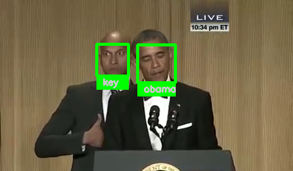

# Face Recognition
## Description

Small face recognition implementation which uses the *face_recognition* library to recognize people in a video based on photos of them.

Runs a bit slow and haven't gotten around to improving it, but it does work in distinguishing between Obama and Key's faces.

## Example

